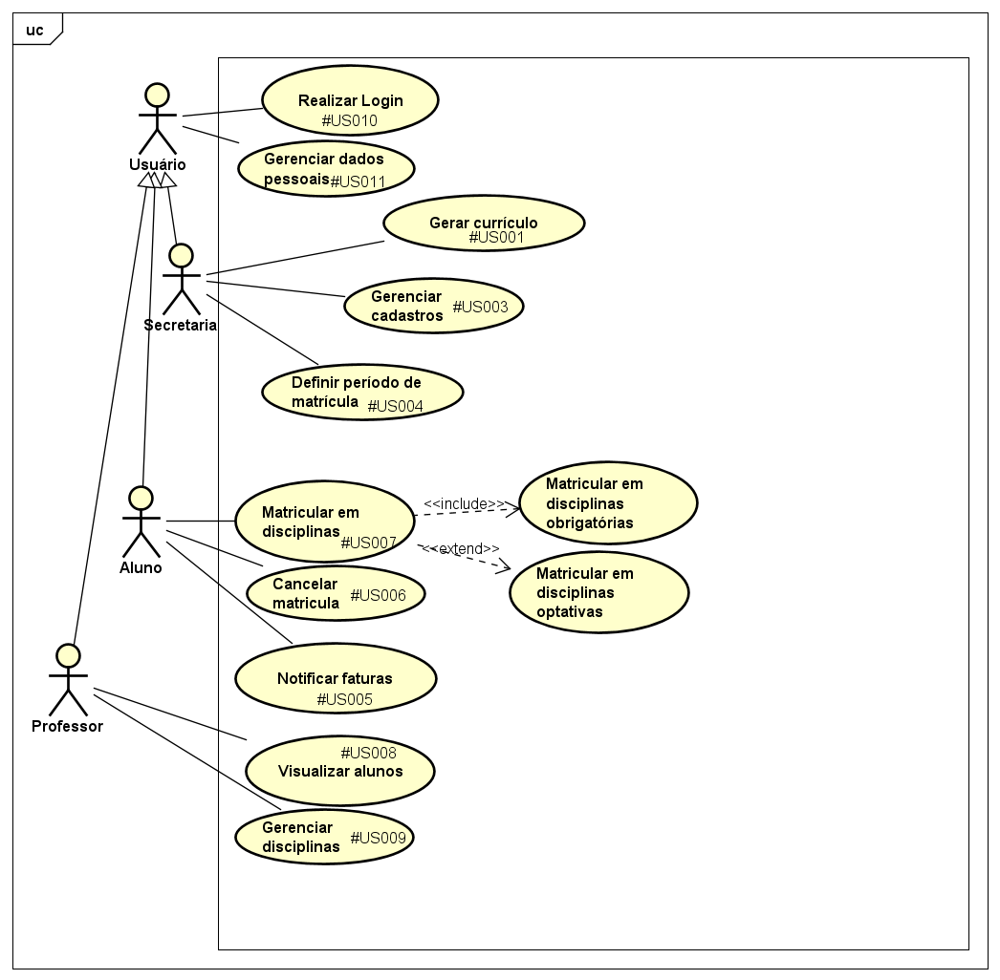

# Laboratório 1 - Sistema de Matrículas

Este repositório contém o projeto de um Sistema de Matrículas para uma Universidade, desenvolvido com o objetivo de informatizar o processo de matrícula dos alunos. O sistema foi projetado para atender às necessidades da secretaria da universidade, professores e alunos, facilitando o gerenciamento de disciplinas, inscrições e cobranças.

## Integrantes
* [Ana Julia Teixeira Candido](https://github.com/anajuliateixeiracandido)
*  [Marcella Ferreira Chaves Costa](https://github.com/marcellafccosta)
*  [Sophia Mendes Rabelo ](https://github.com/sophiaamr)
  

## Histórias de Usuário 

* **Secretaria**

#### US001 - Geração de currículo semestral.
Eu como funcionário da secretaria, quero poder gerar currículo a cada semestre, para completar o sistema com as informações necessárias para cada disciplina e o processo de matrícula.

#### US002 - Manutenção de Informações de Disciplinas, Alunos e Professores.
Eu como funcionário da secretaria, quero poder manter informações sobre as disciplinas, alunos e professores, para garantir que o sistema esteja atualizado.

#### US003 - Cadastro de alunos e professores.
Eu como funcionário da secretaria, quero poder cadastrar alunos e professores no sistema para fins de controle e segurança.

#### US004 - Definição do período de matrículas. 
Eu como funcionário da secretaria, quero poder definir o período de matrículas para manter a organização do semestre seguinte.
 
***

*  **Aluno**

#### US005 - Notificação de Faturas em Aberto
Eu como aluno, quero ser notificado pelo mesmo sistema sobre minhas faturas em aberto, para melhor organização financeira. 

#### US006 - Cancelamento de Matrículas Anteriores
Eu como aluno, quero poder cancelar as matrículas feitas anteriormente, para que eu possa ajustar meu plano de estudos de acordo com novas necessidades.

#### US007 - Matrícula em Disciplinas Obrigatórias e Optativas
Eu como aluno, quero poder me matricular em disciplinas obrigatórias e optativas para preencher a minha grade.

***
* **Professor**

#### US008 - Visualização de disciplinas
Eu como professor, quero poder acessar o sistema, para saber quais são os alunos que estão matriculados nas minhas disciplinas.

#### US009 - Gerenciar disciplinas.
Eu como professor, quero poder gerenciar as disciplinas que estou associado para melhor organização.
***

* **Usuário**
#### US010 - Login de Usuário
Eu como usuário, quero realizar login no sistema para ter acesso as minhas informações.

#### US011 - Gerência de cadastro
Eu como usuário, quero poder gerenciar meus dados pessoais para sempre mantê-los atualizados.
***

## Diagrama de Caso de Uso

 

***
